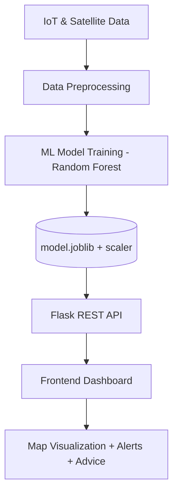

# 🌋 DISASTER MANAGEMENT & EARLY WARNING SYSTEM 
**Real-Time Disaster Prediction and Early Response Platform**  
Developed by *SIVA PRASANTH TIPPISETTI and NATRAJ VEMULA*   

---

## 🛰️ Overview  
This project is an intelligent **Disaster Management & Early Warning System** that leverages **Artificial Intelligence, Machine Learning, IoT Sensors, and Satellite Data** to predict natural disasters and assist communities with real-time alerts and safety actions.  

Built with **Flask (Python)**, **Scikit-Learn (ML)**, and **Leaflet.js (Maps)** — the system predicts multi-hazard risks such as:  
Floods | Earthquakes | Cyclones | Droughts | Wildfires | Landslides  

> 🧠 *Goal:* To provide fast, data-driven alerts that help reduce damage and enable quicker evacuation during natural disasters.

---

## 🚀 Key Features  

| Feature | Description |
|----------|-------------|
| 🗺️ **Live Location Detection** | Automatically detects current location via GPS/IP |
| 🌦️ **Real-Time Weather Integration** | Uses Open-Meteo API to fetch temperature, wind, rainfall |
| 🤖 **Machine Learning Prediction** | Trained on 1990–2024 synthetic + satellite data |
| ⚠️ **Multi-Hazard Risk Analysis** | Detects and classifies disasters by type & severity |
| 💬 **Smart Advisory System** | Provides customized safety instructions per event |
| 🖥️ **Interactive Map UI** | Pulsing markers indicate danger zones with intensity |
| 🌘 **UI** | Elegant dashboard with animated hazard visualizations |

---

## 🧭 System Flow (Mermaid Diagram)
> This diagram shows the full workflow from data collection to user alerts.


```
📂 Project Structure

disaster_app/
│
├── app.py                   # Flask backend (API routes + ML inference)
├── models/
│   ├── features.py           # Feature engineering + scaling
│   ├── train.py              # ML training + model saving
│   └── model.joblib          # Trained (model, scaler)
│
├── static/
│   ├── css/styles.css        # Beautiful dark UI styling
│   └── js/app.js             # Map + location + prediction logic
│
├── templates/
│   └── index.html            # Main dashboard UI
│
├── data/samples/             # Datasets (1990–2024)
│
└── requirements.txt          # Flask + ML dependencies
```

## Setup & Execution

Works perfectly on GitHub Codespaces, local Python, or Render.

1️⃣ Clone this repository

cd LAW_DISTAER/disaster_app

2️⃣ Setup environment

python3 -m venv .venv

source .venv/bin/activate   # (Windows: .venv\Scripts\activate)

3️⃣ Install dependencies

pip install -r requirements.txt

4️⃣ Train model (optional, only once)

python models/train.py

5️⃣ Run Flask app

python app.py

🌐 Access the web app: http://127.0.0.1:5000

## 📊 Dataset (1990–2024)

| Source      | Type           | Key Attributes                  |
| ----------- | -------------- | ------------------------------- |
| USGS        | Seismic Data   | Magnitude, Depth, Location      |
| Open-Meteo  | Climate Data   | Rainfall, Temperature, Wind     |
| IoT Sensors | Ground Data    | Soil Moisture, River Level      |
| Sentinel-2  | Satellite Data | Vegetation Dryness, Cloud Cover |

## 🌪️ Detected Disaster Types

| Disaster       | Key Triggers                      |
| -------------- | --------------------------------- |
| **Flood**      | Rainfall > 120 mm, River > 3.5 m  |
| **Earthquake** | Richter ≥ 4.5                     |
| **Landslide**  | Moisture > 50%, Slope > 30°       |
| **Cyclone**    | Wind Speed > 120 km/h             |
| **Wildfire**   | Temperature > 42°C & Dryness > 80 |
| **Drought**    | Moisture < 10%, Rain < 10 mm      |


## 🎨 User Interface Preview

🌋 Disaster Early Warning Dashboard 

📍 Location: Kent, Ohio, USA (Auto Detected)  

🌦️ Weather: 24°C, Wind 15 km/h, Rainfall 12mm 

⚠️ Risk: HIGH — Possible Flood                

💬 Advice: Move to higher ground immediately  


🗺️ Map view includes pulsing icons for active high-risk areas.


## 📦 Tech Stack

| Layer                | Technology                             |
| -------------------- | -------------------------------------- |
| **Frontend**         | HTML5, CSS3, JavaScript, Leaflet.js    |
| **Backend**          | Flask 3.0, Flask-CORS                  |
| **Machine Learning** | Scikit-Learn, Pandas, NumPy, Joblib    |
| **APIs**             | Open-Meteo, ipapi.co                   |
| **Deployment**       | GitHub Codespaces / Render / Localhost |


